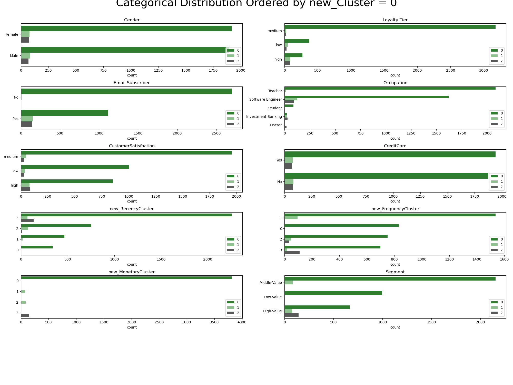
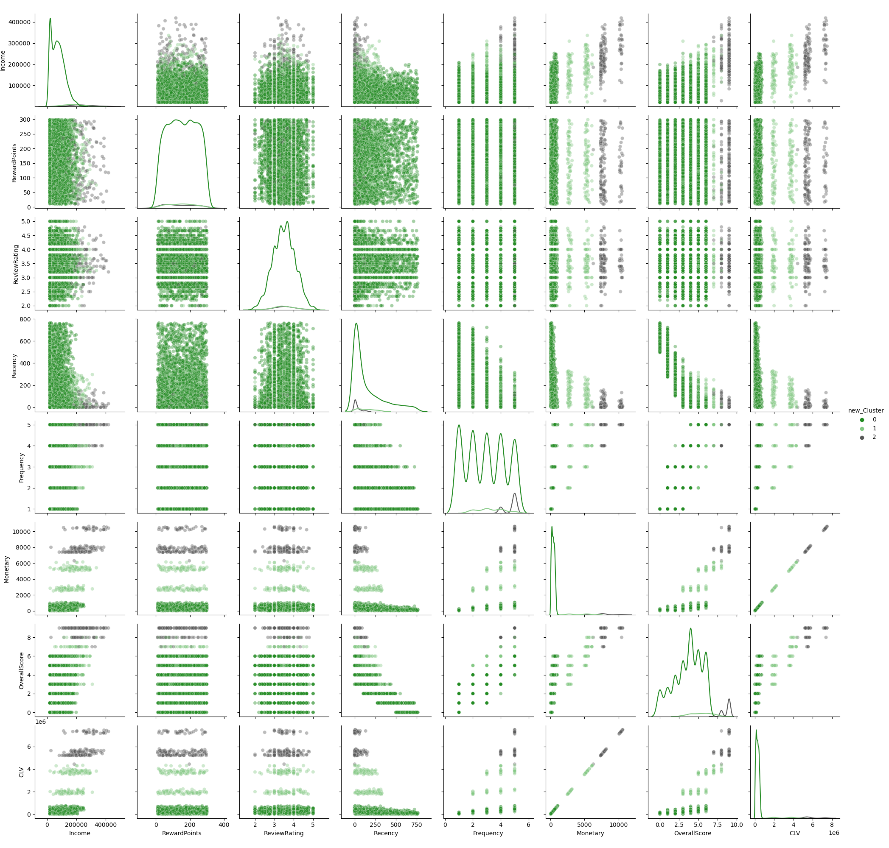

# Customer Lifetime Value Project

The objective of this project is to Customer Segmentation using Customer Lifetime Value (CLV). In this project, we will compute RFM score (Recency, Frequency and Montetary value) and use some clustering techniques to predict their clusters, as well as some classification algorithms to predict customer segment and tune the hyperparameters to improve the performance.

## Data Set

Obtained from Microsoft sample data: <a href="https://learn.microsoft.com/en-us/dynamics365/customer-insights/data/sample-guide-predict-clv"> link </a>

This dataset contains personal characteristics, transaction history, loyalty subscription and reviews of customers from e-commerce purchase activities. It comprised of 19 features and 12,361 instances from 2017-01-01 to 2019-02-06.

## Insights

- There are no significant different of segmentation between male/female and credit-card/no-credit-card.
- Most of customers with medium loyalty tier bring belong to the low-value segment.
- Most of high-value customer segment are email subscriber. 
- Most teachers and students belong to low-value segment; most doctors belongs to high-value segment.
- The customers with high-satisfaction tends to belong to high-value segment.

- High-income customers tend to spend more often, more monetary => highvalue segment.
- Custmoners purchase frequently and have low recency tend to belong to high-value segment.

**Recommendation**
- The teacher and student customer participate in buying a lot but retention rate is not high. Therefore, it's necessary to develop and apply promotion programs aimed at this target groups.
- Most of satisfaction in purchasing are low and middle level, so we must have strategy to improve this.

## RFM segmentation

The RFM clusters are determined by applying clustering techniques such as kmeans, DBSCAN and gaussian mixture. In which, kmeans tends to stable and gives better results. After assign clusters for RFM, we compute RFM score by taking sum of them, then assign segment based on this score. The CLV is calculated by multiplying the Monetary to the average frequency and the average lifespan of customers. Then again, we assign clusters for the CLV using kmeans and our model will use these clusters as target features.

## Model Analysis

Amongst the classifier, Logistic Regression performed the best. On test set, it can detect all the low-value segment cases, the f1 scores of middle-value and high-value segment are little lower with 0.83 and 0.91, respectively. Despite of its simplicity, this model has learned the rules underlying the data and also becomes less overfitted towards the training set after hyperparameter tuning has been done.
