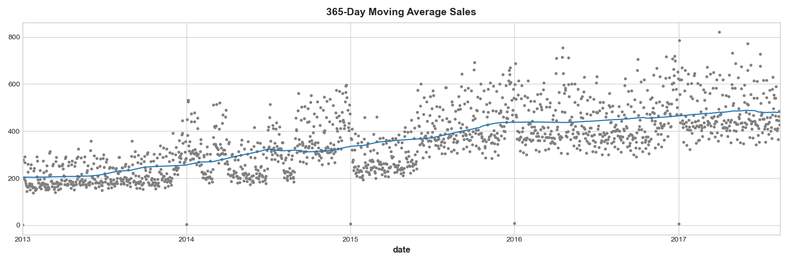
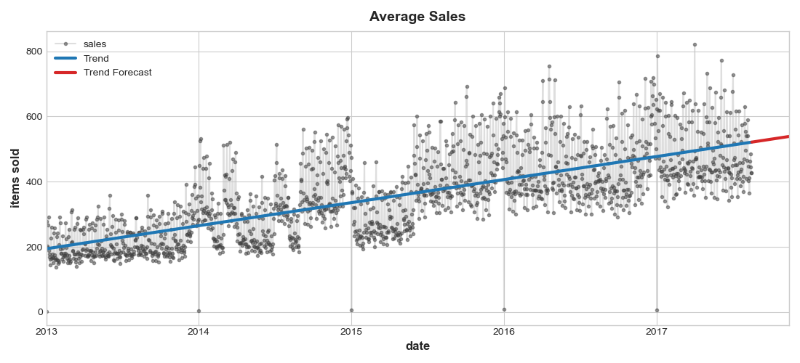
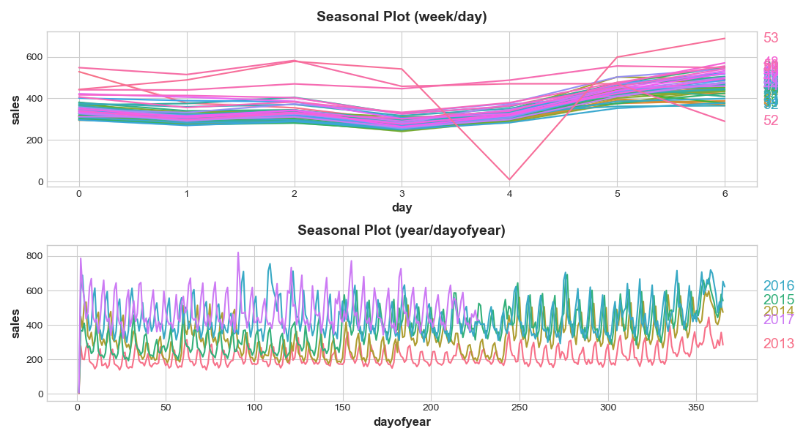
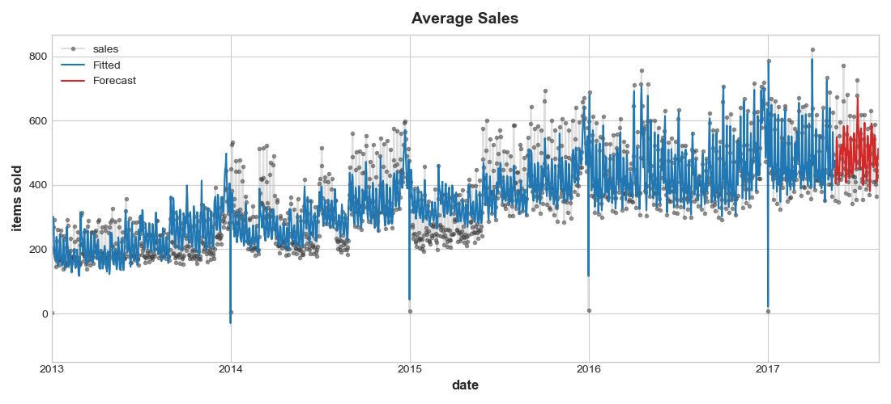
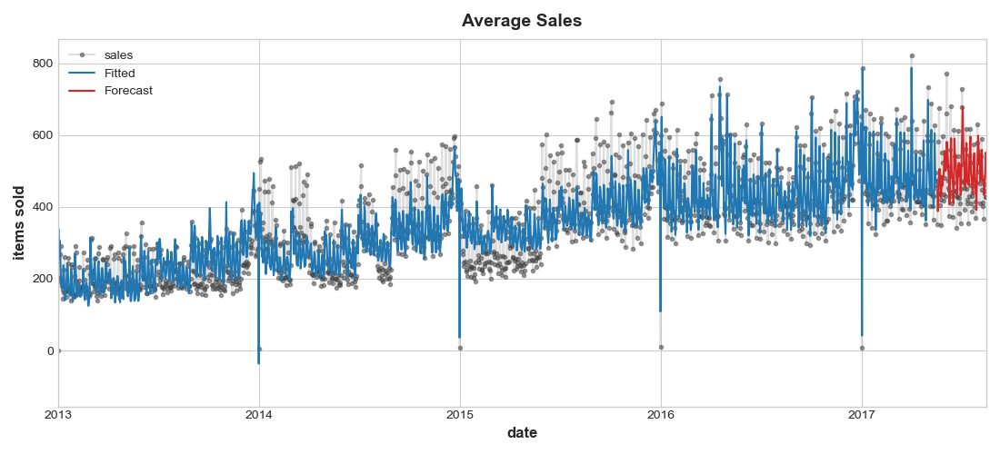
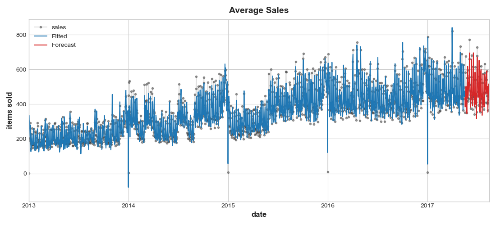

# Store Sales - Time Series Forecasting

The objective of this project is to use time-series forecasting to forecast store sales on data from Corporación Favorita, a large Ecuadorian-based grocery retailer. The result will with accurate forecasting can help the grocery store decrease food waste related to overstocking and improve customer satisfaction.

## Data Set

This dataset contains time series of features: dates, store and product information, whether that item was being promoted, as well as the sales numbers, holidays in year. It's comprised of 3,000,888 instances and 5 features in which 2 numerical and 3 categorical features.

## Results

First, let's take a look at 365-day moving average sale from 2012 to 2017.

We can predict average sales trend roughly 90 days ahead using simple linear regression method.

The seasonal plot show us a strong weekly season and a weaker annualy season.

We will predict sales using time dependent features include: linear trend feature, indicators for weekly season and fourier features with 4 pairs for annualy season. The result is quite good with RMSE = 86.6331.

We added holidays feature as a predictor, but unfortunately the RMSE raised till 90.1358.

To explore the serial dependent predictor, we'll create lag features (7 days) as predictors. The result confirm it with greatly improved RMSE (55.0316).

